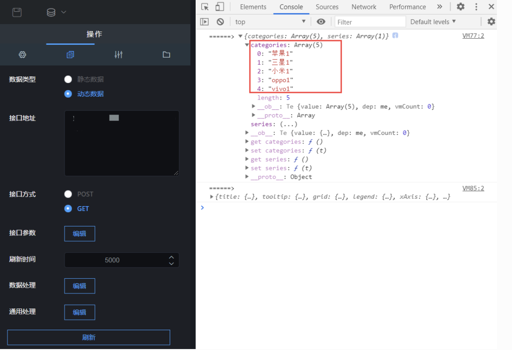

## ① 添加柱形图的组件

柱形图组件就是添加柱形图的组件。点击“”图标，再点击“柱形图”，即可创建新的图像，


## ② 组件名称设置

- 选中该柱形图组件，在操作界面右侧的“图层名称”处可修改组件的名称（名称最好要设置一下，方便后期组件管理）


## ③ 系统配色

- 选中该柱形图组件，在操作界面右侧，打开“系统配色”开关，在“配色选择”下拉框中选择主题色，来修改柱形图组件的配色


- 默认配色：效果图如图 2.131；
- 紫色主题：效果图如图 2.132；
- 绿色主题：效果图如图 2.133；


## ④ 方向设置


想达到图上图 中图表的效果，可如下设置：

选中该柱形图组件，在操作界面右侧，打开“竖展示”开关，就可实现，操作步骤如图 2.15。


## ⑤ 柱体设置


选中该柱形图组件，在操作界面右侧的“柱体设置”处可修改设置组件的外观特点

- 最大宽度：柱体的最大宽度，可以调节改变柱体的宽度；
- 圆角：柱体 4 个角的弧度；
- 最小高度：柱体最小不能低于的高度；

## ⑥ 标题设置


选中该柱形图组件，在操作界面右侧的“标题设置”处可修改柱形图组件的标题样式

- 标题开关：该开关控制标题的显示与隐藏；
- 标题：标题显示的内容；
- 字体颜色：标题的颜色；
- 字体粗细：标题字体的粗细；
- 字体大小：标题字体大小；
- 字体位置：标题的位置，分为：居中、左对齐、右对齐；
- 副标题：副标题内容（如果不想显示副标题，不填写内容就不显示）；
- 字体颜色：副标题字体颜色；
- 字体粗细：副标题字体的粗细；
- 字体大小：副标题字体大小；

## ⑦ X 轴设置


选中该柱形图组件，在操作界面右侧的“X 轴设置”处可修改柱形图组件的 X 轴样式

- 名称：X 轴的名称；
- 显示：X 轴是否显示；
- 显示网格：网格是否显示；
- 轴线颜色：网格线颜色设置；
- 标签间距：每个柱状图之间的距离；
- 文字角度：X 轴文字的旋转角度；
- 轴反转：柱状图顺序左右调转；
- 字号：X 轴字体大小；

## ⑧Y 轴设置

  
  
  


选中该柱形图组件，在操作界面右侧的“Y 轴设置”处可修改柱形图组件的 Y 轴样式

- 名称：Y 轴的名称；
- 显示：Y 轴是否显示；
- 轴网格线：网格是否显示；
- 轴线颜色：网格线颜色设置；
- 轴反转：柱状图顺序上下调转；打开轴翻转开关，效果图如 2.191；
- 字号：Y 轴字体大小；

## ⑨ 字体设置

  


选中该柱形图，在操作界面右侧的“字体设置”处可修改柱体顶部文字的样式，如图 2.192。

- 显示：数值文字是否显示；
- 字体大小：文字的大小；
- 字体颜色：文字的颜色；
- 字体粗细：文字的粗细；

## ⑩ 提示语设置

  
  
  


选中该柱形图组件，在操作界面右侧的“提示语设置”处可修改柱形图组件的提示语，如图 2.193。效果图如图 2.194；

- 字体大小：提示语的字体大小；
- 字体颜色：提示语的字体颜色；

## 11 坐标轴边距设置

  


选中该柱形图组件，在操作界面右侧的“坐标轴边距设置”处可修改柱形图距离左、右、上、下的距离，如图 2.195。

- 左边距（像素）：柱形图距离左边的距离；
- 顶边距（像素）：柱形图距离顶部的距离；
- 右边距（像素）：柱形图距离右边的距离；
- 底边距（像素）：柱形图距离底部的距离；

## 12 图例设置

  
  
  
  
  
  
  
  
  
  
  
  
  


选中该柱形图组件，在操作界面右侧的“图例设置”处可设置图例的样式，如图 2.196；效果图如 2.197。

- 图例开关：是否显示图例；
- 字体颜色：图例的字体颜色。如果要想自定义图例的颜色，需要关闭系统配色（图 2.1971）和删除所有自定义配色（图 2.1972）中的颜色。
- 图例宽度：图例的宽度；
- 横向位置：图例的位置，分为：居中、左对齐、右对齐，如图 2.1973；
- 纵向位置：图例的位置，分为：顶部、底部，如图 2.1974；
- 布局朝向：图例的排列顺序，分为：横排和竖排，如图 2.1975；
- 字体大小：图例的字体大小；

## 13 自定义配色设置

  


选中该柱形图组件，在操作界面右侧的“自定义配色设置”处可配置上边不能设置的内容，如图 2.198。

- 文字颜色：X、Y 轴字体的颜色；
- 轴线颜色：X、Y 轴轴线颜色；
- 配色：柱体的颜色；如果开启了“系统配色”，需要先把系统配色先关掉，这样自定义的柱体颜色才起作用；

## 14 接口设置

选中该柱形图组件，在操作界面右侧，点击“”，可设置接口，如图 2.199。

### 1. 数据类型

数据类型分为静态数据和动态数据；

- 静态数据：写死的数据；
- 动态数据：会随着接口传过来的数据实时变化；（一般这种比较常用）

#### （1）静态数据，接口地址传过来的内容要符合以下格式：

```
（1）两个柱形图接口格式：
{"categories":["苹果","三星","小米","oppo","vivo"],"series":[{"name":"手机品牌","data":[1000879,3400879,2300879,5400879,3400879]},{"name":"手机品牌销售","data":[100087,340087,230087,540087,340087]}]}

（2）一个柱形图接口格式：
{"categories":["苹果","三星","小米","oppo","vivo"],"series":[{"name":"手机品牌","data":[1000879,3400879,2300879,5400879,3400879]}]}

```

#### （2）动态数据，接口地址传过来的内容要符合以下格式：

```
（1）两个柱形图接口格式如下，效果图如图2.1991；
{"data":{"categories":["苹果","三星","小米","oppo","vivo"],"series":[{"name":"手机品牌","data":[1000879,3400879,2300879,5400879,3400879]},{"name":"手机品牌销售","data":[100087,340087,230087,540087,340087]}]}}

（2）一个柱形图接口格式如下，效果图如图2.1992；
{"data":{"categories":["苹果","三星","小米","oppo","vivo"],"series":[{"name":"手机品牌","data":[1000879,3400879,2300879,5400879,3400879]}]}}

```

### 2. 接口地址

- categories：X 轴参数；
- series：柱形内容；内部 name 为柱形名称，data 为柱形相对应 Y 轴的值；

### 3. 刷新时间

这个参数主要针对动态数据设置的，完成数据的实时更新。

!> 如果你想设置成 5 秒刷新一次，可以将刷新时间设置成“5000”；

### 4 刷新数据

这个参数主要是重新请求以下接口，完成数据的更新。


  


### 5. 接口参数

todo 暂时未用到；

### 6. 数据处理

这个参数用于处理图表中的数据，比如：你在不方便修改接口的时候，想修改一下图表中的某一个或某几个数据，可在这里边修改。

  


#### (1) 查看数据格式

- 点击数据“数据处理”的编辑按钮，输入“console.log('======>',option)”，如图 2.1993 操作；再点击“确定”按钮，再点击“刷新”，打开调试模式，就可看到数据格式和数据内容，可根据自己需求修改，如图 2.1994；

  
  
  

  


#### (2)修改格式

```
option=>{
  option.categories=["苹果1","三星1","小米1","oppo1","vivo1"]
  return option
}

```


### 7.通用处理

这个参数用于处理图表中的样式，比如：你在不方便修改的样式或样式配置中没有，可在这里边修改。

  


- #### (1) 查看数据格式：

点击数据“通用处理”的编辑按钮，输入“console.log('======>',option)”，如图 2.1995 操作；再点击“确定”按钮，再点击“刷新”，打开调试模式，就可看到数据格式和数据内容，可根据自己需求修改，如图 2.1996；

  
  
  
  


- #### (2) 修改格式如下：

```
option=>{
  option.title={
          "show": false,
          "text": "销售",
          "left": "left",
          "textStyle": {
              "fontSize": 18,
              "fontWeight": "bolder",
              "color": "#c23531"
          }
      }
  return option
}
```
