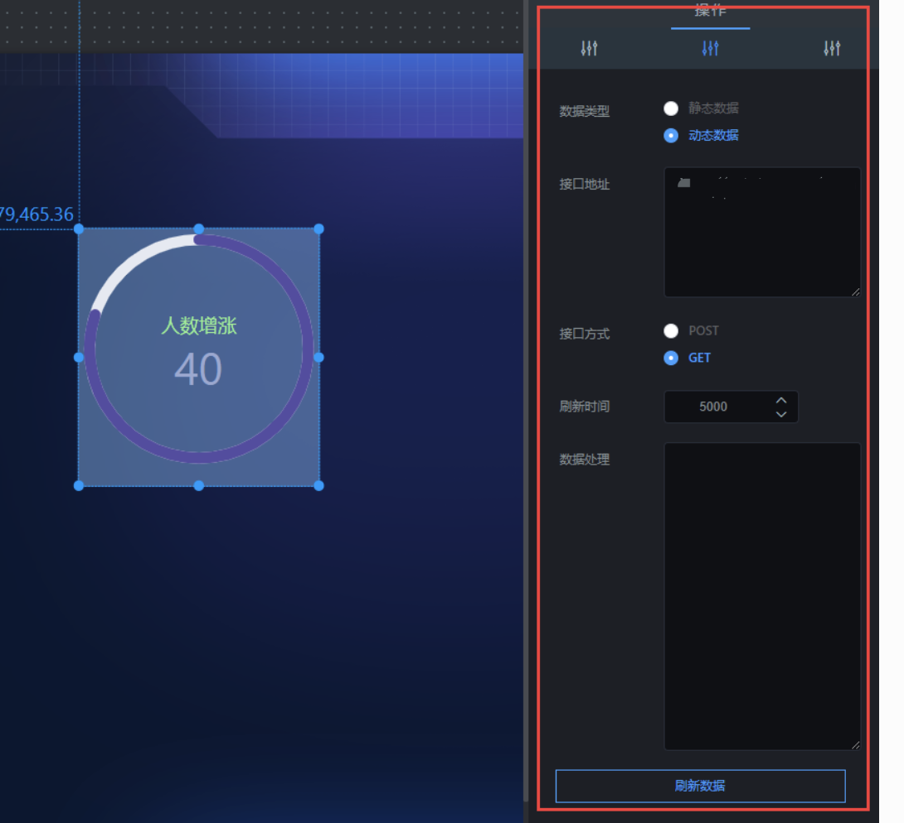

环形图组件就是环状显示某一事件进度的组件。点击“”图标，再点击“环形图”，即可创建环形图，如图 2.41；

  


## **一、组件名称设置**

选中该环形图组件，在操作界面右侧的“图层名称”处可修改组件的名称，如图 2.42。（名称最好要设置一下，方便后期组件管理）

  


## **二、类型**

选中该环形图组件，在操作界面右侧的“类型”处可选择显示样式，如图 2.43；类型包含：线条和圆环。

- 条线图：进度条样式；效果图如图 2.431。

- 环形图：环状样式；效果图如图 2.432。

  
  


## **三、 间距**

选中该环形图组件，在操作界面右侧的“间距”处可修改文字和进度条的间距，如图 2.44。

!> 备注：数值越大，文字离进度条越远

  


## **四、边框颜色**

选中该环形图组件，在操作界面右侧的“边框颜色”处可修改进度条的颜色，如图 2.45。

  


## **五、字体设置**

- 字体大小：修改图 2.46 标注文字大小；

- 字体颜色：修改图 2.46 标注文字颜色；

- 文字粗细：修改图 2.46 标注文字粗细；

  


## **六、前缀设置**

- 前缀字体大小：修改图 2.47 标注文字大小；

- 前缀字体颜色：修改图 2.47 标注文字颜色；

- 前缀文字粗细：修改图 2.47 标注文字粗细；

  


## **七、接口设置**

### 1\. 数据类型

### 数据类型

- 静态数据：写死的数据；
- 动态数据：会随着接口传过来的数据实时变化；（一般这种比较常用）

#### （1）静态数据，接口地址穿过来的内容要符合以下格式：

```
{"label":"人数增涨","value":40,"data":90}

```

#### （2）动态数据，接口地址穿过来的内容要符合以下格式：

```
{"data":{"label":"人数增涨","value":40,"data":90}}


### 2\. 接口地址

-  label：为前缀内容；
-  value：为文字内容；
-  data：为百分比；


```

### 3\. 刷新时间

这个参数主要针对动态数据设置的，完成数据的实时更新。

- 如果你想设置成 5 秒刷新一次，可以将刷新时间设置成“5000”；

### 4\. 刷新数据

这个参数主要是重新请求以下接口，完成数据的更新。




### 5.其他样式

- 如图 2.49 中样式，接口设置格式如下：

  
  
备注：如果接口中配置“content”和“data”值，环形图就显示百分值；

#### （1）静态数据，接口地址穿过来的内容要符合以下格式：

```
{ "label": "人数增涨",
 "value": 40,
 "content": "%", "data": 80}

```

#### （2）动态数据，接口地址穿过来的内容要符合以下格式：

```
{"data":{ "label": "人数增涨",
 "value": 40,
 "content": "%", "data": 80}}
```
