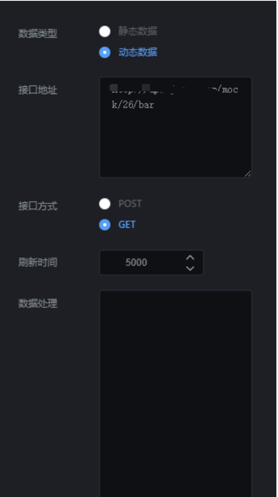

雷达图组件就是添加雷达图的组件。点击“”图标，再点击“雷达图”，即可创建新的图像，如图 2.61；

  


## **一、组件名称设置**

选中雷达图组件，在操作界面右侧的“图层名称”处可修改组件的名称，如图 2.62。（名称最好要设置一下，方便后期组件管理）

  


## **二、系统配色**

选中该雷达图组件，在操作界面右侧，打开“系统配色”开关，在“配色选择”下拉框中选择主题，来修改雷达图组件的配色，如图 2.63。

\*\* 备注：使用系统配色，需要先删除自定义颜色；\*\*

- 默认配色：效果图如图 2.631；

- 紫色主题：效果图如图 2.632；

- 绿色主题：效果图如图 2.633；

  
  


## **三、字体大小**

选中该雷达图，在操作界面右侧的“字体大小”处可修改文字的大小，如图 2.64。

  


## **四、字体颜色**

选中该雷达图，在操作界面右侧的“字体颜色”处可修改文字的颜色，如图 2.65。

  


## **五、区域透明度**

选中该雷达图组件，在操作界面右侧，拖动“区域透明度”，可设置雷达区域的透明度，如图 2.66。

- 0~1，透明度不断变小，0 的透明度最大，1 透明度最小（即不透明）；

  


## **六、标题设置**

选中该雷达图组件，在操作界面右侧的“标题设置”处可修改雷达图组件的标题样式，如图 2.67。

- 标题开关：该开关控制标题的显示与隐藏；
- 标题：标题显示的内容；
- 字体颜色：标题的颜色；
- 字体粗细：标题字体的粗细；
- 字体大小：标题字体大小；
- 字体位置：标题的位置，分为：居中、左对齐、右对齐；
- 副标题：副标题内容；
- 字体颜色：副标题字体颜色；
- 字体粗细：副标题字体的粗细；
- 字体大小：副标题字体大小；

  


## **七、字体设置**

选中该雷达图，在操作界面右侧的“字体设置”处可修改雷达图组件的数字字体样式，如图 2.68。

- 显示：数值文字是否显示；
- 字体大小：文字的大小；
- 字体颜色：文字的颜色；
- 字体粗细：文字的粗细；

  


## **八、提示语设置**

选中该雷达图组件，在操作界面右侧的“提示语设置”处可修改雷达图组件的提示语，如图 2.69。

- 字体大小：提示语的字体大小；
- 字体颜色：提示语的字体颜色；

  


## **九、图例设置**

选中该雷达图组件，在操作界面右侧的“图例设置”处可设置图例的样式，如图 2.691；效果图如图 2.692。

- 图例开关：是否显示图例；
- 图例高度：图例图标的高度；
- 图例宽度：图例图标的宽度；
- 位置：图例的位置，分为：居中、左对齐、右对齐；
- 布局朝向：图例的排列顺序，分为：横排和竖排；
- 字体大小：图例的字体大小；

  
  
  


## **十、自定义配色设置**

选中该折线图组件，在操作界面右侧的“自定义配色设置”处可配置上边不能设置的内容，如图 2.692。

- 文字颜色、 轴线颜色暂时不起作用（后期会有版本优化）；
- 配色：雷达覆盖区域的颜色，如果开启了“系统配色”，需要先把系统配色先关掉，这样自定义的颜色才起作用；

  


## **十一、接口设置**

选中该雷达图组件，在操作界面右侧，点击“”，可设置接口，如图 2.694。

### 1\. 数据类型

数据类型分为静态数据和动态数据；

- 静态数据：写死的数据；
- 动态数据：会随着接口传过来的数据实时变化；（一般这种比较常用）

### 2\. 接口地址

#### （1）静态数据，接口地址传过来的内容要类似以下格式：

```
{"indicator":[{"name":"销售（sales）","max":6500},{"name":"管理（Administration）","max":16000},{"name":"信息技术（Information Techology）","max":30000},{"name":"客服（Customer Support）","max":38000},{"name":"研发（Development）","max":52000},{"name":"市场（Marketing）","max":25000}],"series":[{"data":[{"value":[4300,10000,28000,35000,50000,19000],"name":"预算分配（Allocated Budget）"}]}]}

```

#### （2）动态数据，接口地址传过来的内容要类似以下格式：

```
{"data":{"indicator":[{"name":"销售（sales）","max":6500},{"name":"管理（Administration）","max":16000},{"name":"信息技术（Information Techology）","max":30000},{"name":"客服（Customer Support）","max":38000},{"name":"研发（Development）","max":52000},{"name":"市场（Marketing）","max":25000}],"series":[{"data":[{"value":[4300,10000,28000,35000,50000,19000],"name":"预算分配（Allocated Budget）"}]}]}}

```

### 3\. 刷新时间

这个参数主要针对动态数据设置的，完成数据的实时更新。

- 如果你想设置成 5 秒刷新一次，可以将刷新时间设置成“5000”；

### 4\. 刷新数据

这个参数主要是重新请求以下接口，完成数据的更新。



