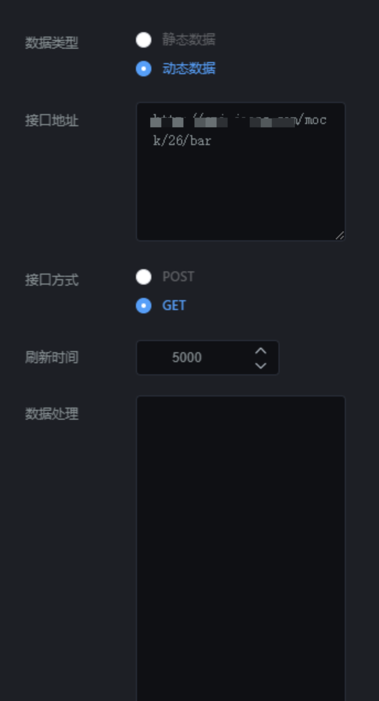

散点图组件就是添加散点图的组件。点击“”图标，再点击“雷达图”，即可创建新的图像，如图 2.71；

  


## **一、组件名称设置**

选中散点图组件，在操作界面右侧的“图层名称”处可修改文本组件的名称，如图 2.72。（名称最好要设置一下，方便后期组件管理）

  


## **二、系统配色**

选中该散点图组件，在操作界面右侧，打开“系统配色”开关，在“配色选择”下拉框中选择颜色，来修改散点图组件的配色，如图 2.73。

  


## **三、气泡大小**

选中该散点图，在操作界面右侧的“气泡大小”处可修改点的大小，如图 2.74。

  


## **四、字体位置**

选中该散点图图，在操作界面右侧，通过设置“字体位置”，来修改字体样式，如图 2.75。

- 顶部：字体位于圆点的顶部；
- 内部：字体位于圆点的内部；

- 左部：字体位于圆点的左部；

- 右部：字体位于圆点的右部；

  


## **五、内容格式化**

选中该散点图组件，在操作界面右侧，在内容格式化中输入代码，可格式化样式。

## **六、X 轴设置**

选中该散点图组件，在操作界面右侧的“X 轴设置”处可修改散点图组件的 X 轴样式，如图 2.76。

- 名称：X 轴的名称；

- 显示：X 轴是否显示；

- 显示网格：网格是否显示；

- 轴线颜色：网格线颜色设置；

- 标签间距：每个柱状图之间的距离；

- 文字角度：X 轴文字的旋转角度；

- 轴反转：柱状图顺序左右调转；

- 字号：X 轴字体大小；

  


## **七、Y 轴设置**

选中该散点图组件，在操作界面右侧的“Y 轴设置”处可修改散点图组件的 Y 轴样式，如图 2.77。

- 名称：Y 轴的名称；
- 显示：Y 轴是否显示；
- 轴网格线：网格是否显示；
- 轴线颜色：网格线颜色设置；
- 轴反转：柱状图顺序上下调转；
- 字号：Y 轴字体大小；

  


## **八、字体设置**

选中该散点图，在操作界面右侧的“字体设置”处可修改散点图组件的字体样式，如图 2.78。

- 显示：数值文字是否显示；
- 字体大小：文字的大小；
- 字体颜色：文字的颜色；
- 字体粗细：文字的粗细；

  


## **九、提示语设置**

选中该散点图组件，在操作界面右侧的“提示语设置”处可修改散点图组件的提示语，如图 2.79。

- 字体大小：提示语的字体大小；
- 字体颜色：提示语的字体颜色；

  


## **十、自定义配色设置**

选中该散点图组件，在操作界面右侧的“自定义配色”处可配置上边不能设置的内容，如图 2.791。

- 文字颜色、 轴线颜色暂时不起作用（后期会有版本优化）；
- 配色：雷达覆盖区域的颜色；

  


## **十一、接口设置**

选中该雷达图组件，在操作界面右侧，点击“”，可设置接口，如图 2.792。

### 1\. 数据类型

数据类型分为静态数据和动态数据；

- 静态数据：写死的数据；
- 动态数据：会随着接口传过来的数据实时变化；（一般这种比较常用）

### 2\. 接口地址

#### （1）静态数据，接口地址传过来的内容要类似以下格式：

```
{"data":[{"data":[[1,8.04],[2,6.95]]},{"data":[[1,4.04],[2,3.95]]}]}

```

#### （2）动态数据，接口地址传过来的内容要类似以下格式：

```
{"data":[{"data":[[1,8.04],[2,6.95]]},{"data":[[1,4.04],[2,3.95]]}]}

```

### 3\. 刷新时间

这个参数主要针对动态数据设置的，完成数据的实时更新。

- 如果你想设置成 5 秒刷新一次，可以将刷新时间设置成“5000”；

### 4\. 刷新数据

这个参数主要是重新请求以下接口，完成数据的更新。



