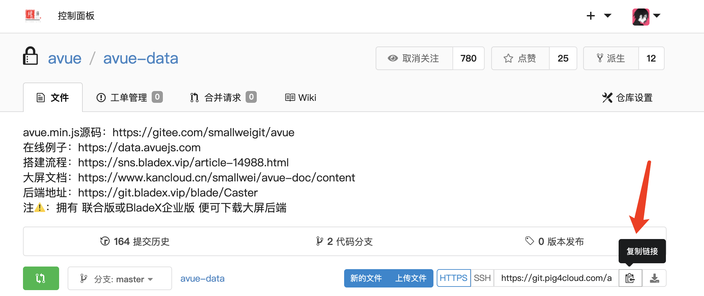

## 一、**工程导入**
1. 使用Avue商业账号登录git私服：https://git.avuejs.com/avue/avue-data

2. 导入工程,在终端执行yarn install或者npm install

## 二、**配置修改**
1.这里要运行大屏后端
- [JAVA版后端启动](./1.后端启动.md)
- [NODE版后端启动](./Node版后端启动.md)
2. <b style="color:red">修改你自己的后端地址，默认是演示线上接口</b>

## 三、**工程启动**
1. 命令行执行 `yarn run serve`，看到如下日志则说明启动成功

2. 访问 http://localhost:8080 查看效果

