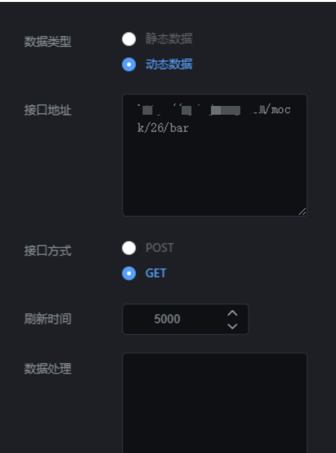

选项卡组件就是设置选项卡样式的组件。点击“”图标，再点击“选项卡”，即可创建新的表格，如图 6.21；

  


## **一、组件名称设置**

选中该选项卡组件，在操作界面右侧的“图层名称”处可修改组件的名称，如图 6.22。（名称最好要设置一下，方便后期组件管理）

  


## **二、字体设置**

选中该选项卡组件，在操作界面右侧的“字体大小”、“字体颜色”和“字体间距”处可修改组件的字体样式，如图 6.23。

- 字体大小：可修改文字的大小；

- 字体颜色：可修改文字的颜色；

- 字体间距：可修改“选项卡 1”与“选项卡 2”之间的距离；

  


## **三、边框设置**

选中该选项卡组件，在操作界面右侧的“边框设置”处可设置选项卡的边框样式，如图 6.24。

- 背景颜色：选项卡的背景颜色；

- 缩略图：背景图缩略图；

- 背景图片：背景图片上传；

- 边框颜色：边框的颜色；

- 边框宽度：边框宽度；

  


## **四、高亮设置**

选中该选项卡组件，在操作界面右侧的“高亮设置”处可设置选项卡的选中的样式，如图 6.25。

- 字体高亮颜色：设置选中的字体颜色；

- 缩略图：背景图缩略图；

- 背景图片：背景图片上传；

- 边框颜色：边框的颜色；

- 边框宽度：边框宽度；

  


## **五、选项卡切换**

- 要想实现选项卡动态切换，需要在“”中选择“子类”，填写参数，就可实现选择子类数据的动态切换；

- 子类：想要实现通过选项卡切换，实现数据切换的组件，可以是柱形图，也可以是环形图等；

- 参数：随便写，可以是 key;

- 本组件只可实现一个组件的数据动态切换，不能实现切换的时候，组件样式变化；

  


## **五、接口设置**

选中该柱形图组件，在操作界面右侧，点击“”，可设置接口，如图 6.27。

### 1\. 数据类型

数据类型分为静态数据和动态数据；

- 静态数据：写死的数据；

- 动态数据：会随着接口传过来的数据实时变化；（一般这种比较常用）

### 2\. 接口地址

#### （1）静态数据，接口地址传过来的内容要符合以下格式：

```
[
    {
        "label": "选项卡1",
        "value": "1"
    },
    {
        "label": "选项卡2",
        "value": "2"
    }
]

```

#### （2）动态数据，接口地址传过来的内容要符合以下格式：

```
{"data":[{"label":"选项卡1","value":"1"},{"label":"选项卡2","value":"2"},{"label":"选项卡3","value":"3"}]}

```

#### （3）如果有多个选项，就在接口中添加多个选项就可以。比如有 3 个选项，接口格式如下：

```
[
    {
        "label": "选项卡1",
        "value": "1"
    },
    {
        "label": "选项卡2",
        "value": "2"
    }
,
   {
        "label": "选项卡3",
        "value": "3"
    }
]

```

### 3\. 刷新时间

这个参数主要针对动态数据设置的，完成数据的实时更新。

- 如果你想设置成 5 秒刷新一次，可以将刷新时间设置成“5000”；

### 4\. 刷新数据

这个参数主要是重新请求以下接口，完成数据的更新。



