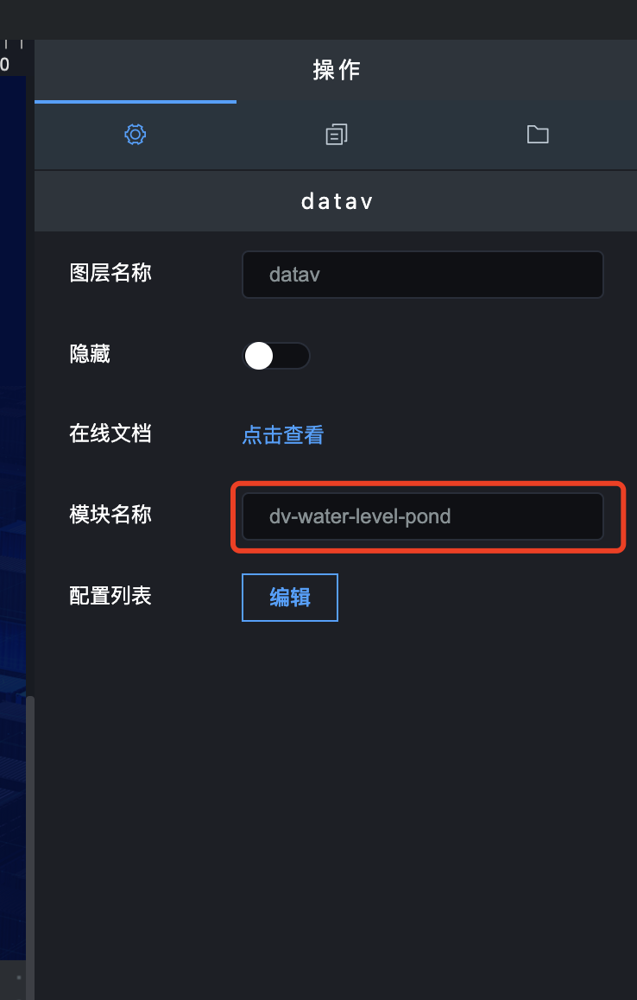

## **一、组件名称设置**

设置组件的数据格式，可以参考官网的 config 配置http://datav.jiaminghi.com/guide/waterLevelPond.html

## **二、接口设置**

### 1\. 数据类型

数据类型分为静态数据和动态数据；

- 静态数据：写死的数据；
- 动态数据：会随着接口传过来的数据实时变化；

### 2\. 接口地址

#### （1）静态数据，和组件结构一致

#### （2）动态数据，和组件结构一致

### 3\. 刷新时间

这个参数主要针对动态数据设置的，完成数据的实时更新。

- 如果你想设置成 5 秒刷新一次，可以将刷新时间设置成“5000”；
