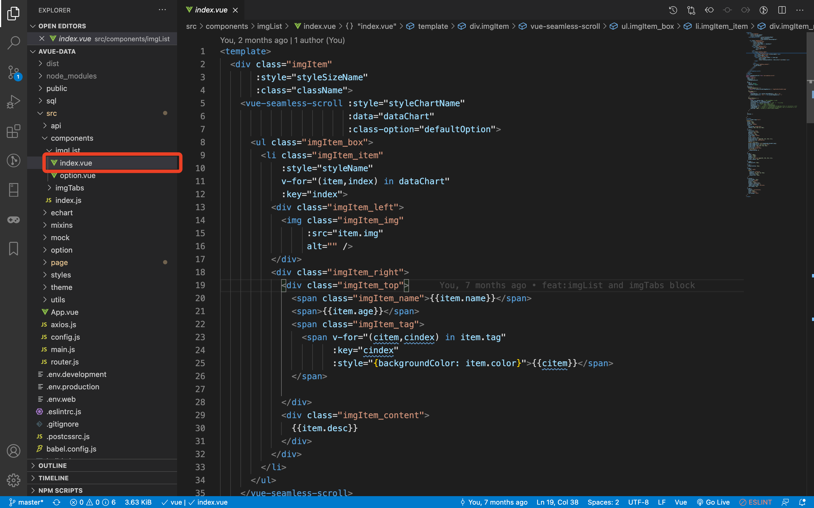
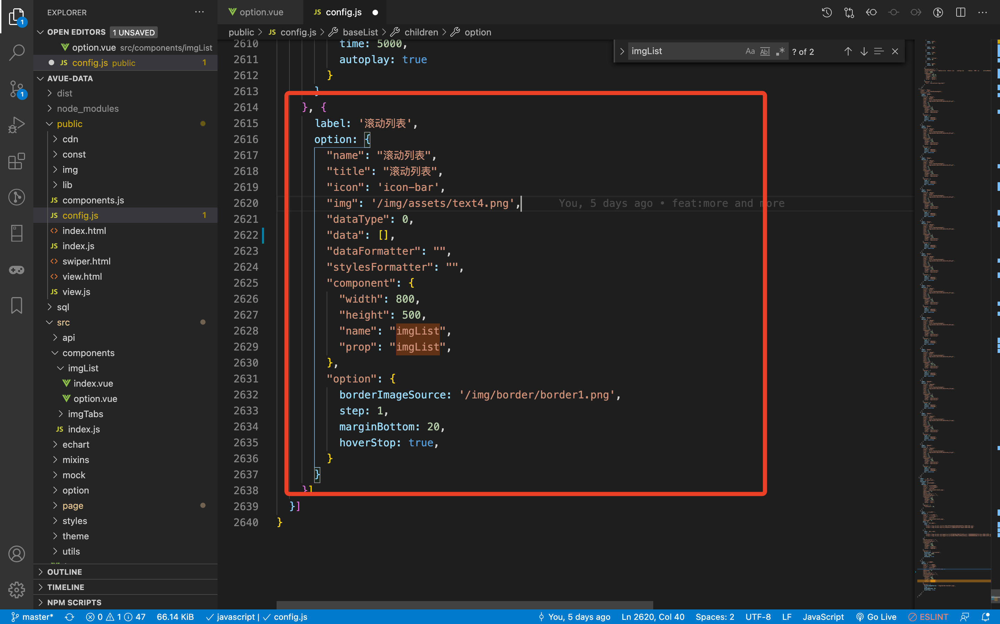
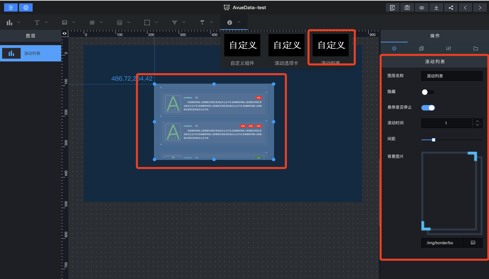

## 内部组件

> 组件文件路径/src/components/\*\*.js，配置对应组件，系统会自动引入模块

### 组件模块

> 编写组件的模块/src/components/imgList/index.vue

### 配置模块

> 编写配置模块/src/components/imgList/option.vue

### 组件引用

> 配置文件文件路径/public/config.js

### 最终效果

