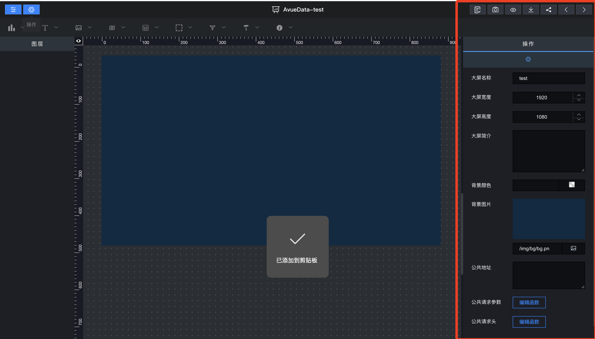
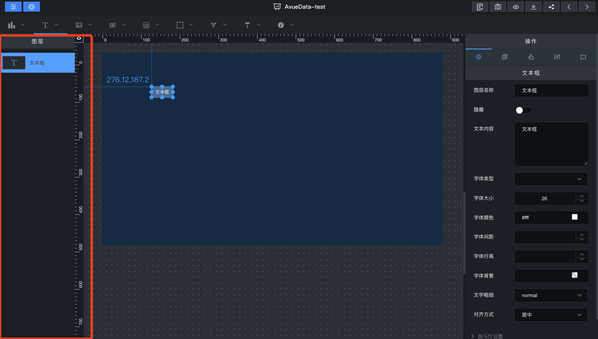

## ① 组件栏

> 画布顶部为组件栏，可以点击使用任何组件

## ② 画布区域

> 标注的地方为画布区域，可以在画布内使用任何组件进行设计；

## ③ 样式区域

> 画布右侧为样式区域可以通过调整样式区域的参数来设置画布的大小、颜色等；

## ④ 图层的区域

> 画布左侧为图层区域，如图 3.14；可以通过名称快速定位到画布中的组件；

## ⑤ 操作栏

> 可以对大屏进行保存，导出，回退等相关操作

