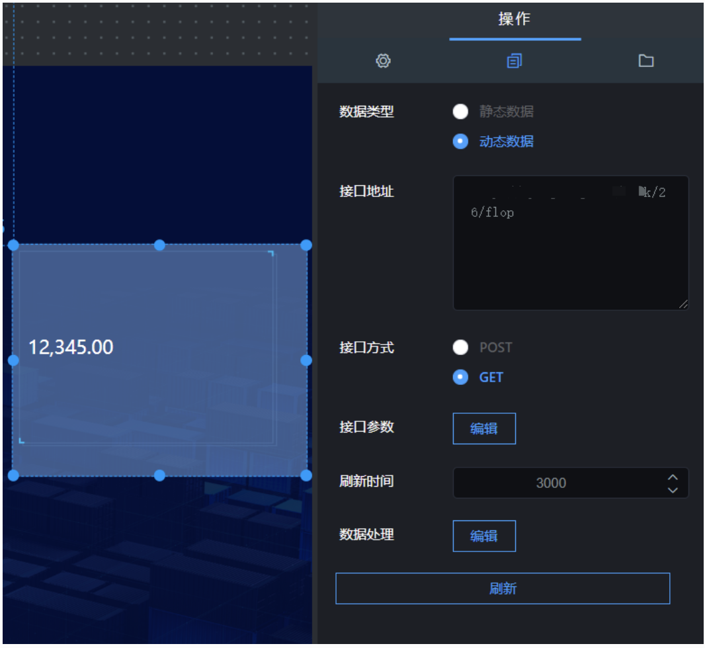

翻牌器组件就是添加数字各种样式的组件。点击“”图标，再点击“翻牌器”，即可创翻牌器，如图 5.11；

  


## **一、组件名称设置**

选中该翻牌器组件，在操作界面右侧的“图层名称”处可修改组件的名称，如图 5.12。（名称最好要设置一下，方便后期组件管理）

  


## **二、基本样式设置**

### 1\. 整体

选中该字符云组件，在操作界面右侧的“整体”处可把数字设置成整体的样式，如图 5.13；

  


### 2\. 横行

选中该字符云组件，在操作界面右侧的“横行”处可对横行 进行设置样式，如图 5.14；

  


### 3\. 精度

选中该字符云组件，在操作界面右侧的“精度”处修改，可设置数值保留的小数位数，设置好后，点击预览可以看到效果，如图 5.15，预览样式如图 5.151；

  
  
  


### 4\. 边框设置

选中该字符云组件，在操作界面右侧的“边框设置”处修改，设置好后，点击预览可以看到效果，如图 5.16；

- 间距：边款与文字的间距，默认文字居中，调整间距值，文字向下移动；

- 边框：可设置边框样式；分为：无边框、内置图片、内置边框；

```
       * 无边框：设置无边框的翻牌器，可以用这个设置一些大一点的数字或者钱，样式如图5.161；
       * 内置图片：设置翻牌器的背景，如可设置图片地址、背景图片、背景颜色，样式如图5.162；
       * 内置边框：设置翻牌器的边框样式，如可设置边框颜色、边框宽度、背景颜色，样式如图5.163；

```

  
  


### 5\. 内部设置

选中该字符云组件，在操作界面右侧的“内部设置”处可修改文字样式，如图 5.17；

```
   * 字体大小：翻牌器内文字的大小；
   * 字体颜色：翻牌器内文字颜色；
   * 字体粗细：翻牌器内文字粗细；
   * 对齐方式：翻牌器内文字对齐方式；

```

  


### 6\. 前缀设置

选中该字符云组件，在操作界面右侧的“前缀设置”处可设置前缀样式，如图 5.18；

```
* 前缀内容：前缀要显示的内容；
* 对齐方式：前缀的对齐方式；
* X间距：前缀跟X轴的间距；
* Y间距：前缀跟Y轴间距；
* 颜色：前缀字体颜色；
* 字体大小：前缀字体大小；

```

  


### 7\. 后缀设置

选中该字符云组件，在操作界面右侧的“前缀设置”处可设置前缀样式，如图 5.19；

```
* 前缀内容：前缀要显示的内容；
* 对齐方式：前缀的对齐方式；
* X间距：前缀跟X轴的间距；
* Y间距：前缀跟Y轴间距；
* 颜色：前缀字体颜色；
* 字体大小：前缀字体大小；

```

  


## **三、接口设置**

### 1\. 数据类型

数据类型分为静态数据和动态数据；

- 静态数据：写死的数据；
- 动态数据：会随着接口传过来的数据实时变化；（一般这种比较常用）

### 2\. 接口地址

#### （1）静态数据，接口地址穿过来的内容要符合以下格式：

```
{
    "value": "12345"
}

```

#### （2）动态数据，接口地址穿过来的内容要符合以下格式：

```
{"data":{"value":"1234567"}}

```

### 3\. 刷新时间

这个参数主要针对动态数据设置的，完成数据的实时更新。

- 如果你想设置成 5 秒刷新一次，可以将刷新时间设置成“5000”；

### 4\. 刷新数据

这个参数主要是重新请求以下接口，完成数据的更新。



