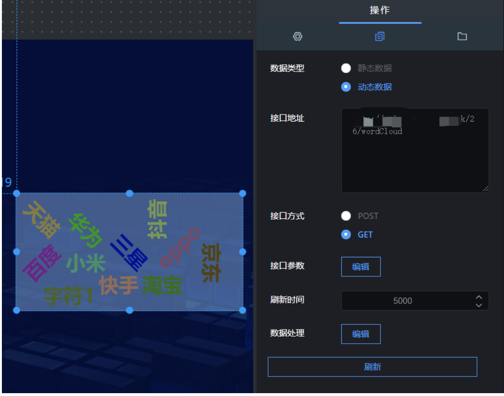

字符云组件就是设置字符效果的组件，效果图如图 5.31。点击“”图标，再点击“字符云”，即可创建字符云，如图 5.32；

  
  
  


## **一、组件名称设置**

选中该字符云组件，在操作界面右侧的“图层名称”处可修改组件的名称，如图 5.33。（名称最好要设置一下，方便后期组件管理）

  


## **二、样式设置**

### 1\. 最小字体

选中字符云组件，在操作界面右侧，在“最小字体”设置最小字体，如图 5.34；

  


### 2\. 最大字体

选中字符云组件，在操作界面右侧，在“最大字体”设置最大字体，如图 5.35；

  


### 3\. 间距

选中该字符云组件，在操作界面右侧的“间距”处可设置文字的间距，如图 5.36。

  


### 4\. 旋转

- 选中该字符云组件，在操作界面右侧，打开“旋转”按钮，字符设置成旋转状态，如图 5.37。

- 关闭“旋转”按钮，样式如图 5.38；

  
  
  


## **三、接口设置**

### 1\. 数据类型

数据类型分为静态数据和动态数据；

- 静态数据：写死的数据；

- 动态数据：会随着接口传过来的数据实时变化；（一般这种比较常用）

### 2\. 接口地址

#### （1）静态数据，接口地址穿过来的内容要符合以下格式：

```
[
    {
        "name": "三星",
        "value": "1234"
    },
    {
        "name": "小米",
        "value": "1234"
    },
    {
        "name": "华为",
        "value": "1234"
    },
    {
        "name": "oppo",
        "value": "1234"
    },
    {
        "name": "抖音",
        "value": "1234"
    },
    {
        "name": "快手",
        "value": "1234"
    },
    {
        "name": "淘宝",
        "value": "1234"
    },
    {
        "name": "百度",
        "value": "1234"
    },
    {
        "name": "京东",
        "value": "1234"
    },
    {
        "name": "天猫",
        "value": "1234"
    },
    {
        "name": "字符1",
        "value": "1234"
    },
    {
        "name": "字符1",
        "value": "1234"
    }
]

```

#### （2）动态数据，接口地址穿过来的内容要符合以下格式：

```
{"data":[
          {
                "name": "三星",
                "value": "1234"
            },
            {
                "name": "小米",
                "value": "1234"
            },
            {
                "name": "华为",
                "value": "1234"
            },
            {
                "name": "oppo",
                "value": "1234"
            },
            {
                "name": "抖音",
                "value": "1234"
            },
            {
                "name": "快手",
                "value": "1234"
            },
            {
                "name": "淘宝",
                "value": "1234"
            },
            {
                "name": "百度",
                "value": "1234"
            },
            {
                "name": "京东",
                "value": "1234"
            },
            {
                "name": "天猫",
                "value": "1234"
            },
            {
                "name": "字符1",
                "value": "1234"
            },
            {
                "name": "字符1",
                "value": "1234"
            }
]}

```

### 3\. 刷新时间

这个参数主要针对动态数据设置的，完成数据的实时更新。

- 如果你想设置成 5 秒刷新一次，可以将刷新时间设置成“5000”；

### 4\. 刷新数据

这个参数主要是重新请求以下接口，完成数据的更新。



