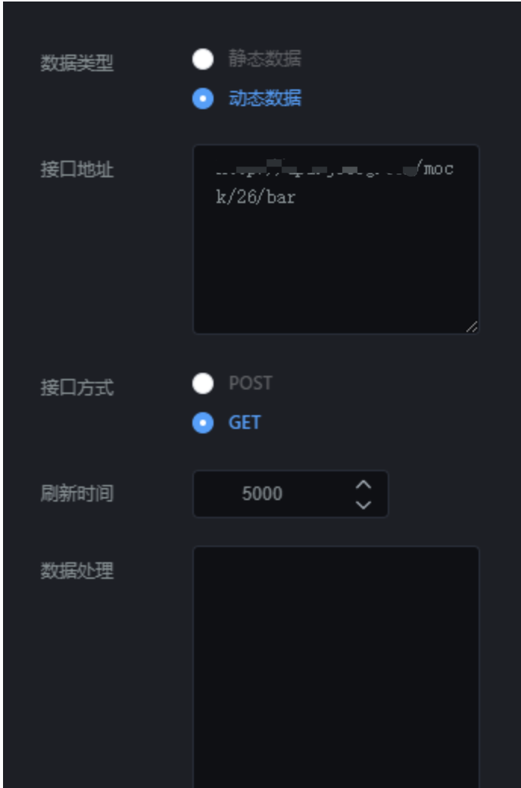

<iframe src="//player.bilibili.com/player.html?aid=385013567&bvid=BV1YZ4y1q7SP&cid=747212629&page=1&high_quality=1" scrolling="no" border="0" frameborder="no" framespacing="0" allowfullscreen="true" width="100%" height="600"> </iframe>

表格组件就是设置表格样式的组件。点击“”图标，再点击“表格”，即可创建新的表格，如图 6.11；

  


## **一、组件名称设置**

选中该表格组件，在操作界面右侧的“图层名称”处可修改组件的名称，如图 6.12。（名称最好要设置一下，方便后期组件管理）

  


## **二、字体大小**

选中该表格组件，在操作界面右侧的“字体大小”处可设置表格内文字大小，如图 6.13。

  


## **三、显示行高**

选中该表格组件，在操作界面右侧的“显示行高”处可设置表格的行高，如图 6.14。

**备注：从 1 开始，数字越大，行高越小**  
  


## **四、开启滚动**

选中该表格组件，在操作界面右侧，打开“开启滚动”开关，输入滚动时间、滚动行数，设置表格的滚动样式，如图 6.15。

- 滚动时间：多久滚动一次；（单位毫秒）

- 滚动行数：每滚动一次，滚动几行；

  


## **五、开启排名**

开启排名之后，会在页面显示排名样式，如图 6.16；

  


## **六、列显隐**

选中该表格组件，在操作界面右侧，打开“开启显隐”开关，可在页面设置显示和隐藏某一列，如图 6.17。

  


## **七、表头设置**

选中该表格组件，在操作界面右侧的“表头设置”处可设置表头的样式，如图 6.18。

- 表头显隐：设置表头是否显示；

- 表头颜色：设置表头文字颜色；

- 表头背景：设置表头的背景颜色；

  


## **八、表格设置**

选中该表格组件，在操作界面右侧的“表格设置”处可设置表格的样式，如图 6.19。

- 文字颜色：设置表格文字颜色；

- 表格背景：设置表格的背景颜色；

- 边框宽度：设置表格边框的粗细大小；

- 边框颜色：设置表格变宽的颜色；

- 边框样式：包含实线、虚线和隐藏；

- 奇行颜色：设置表头奇数行的颜色；

- 偶行颜色：设置表格偶数行的颜色；

  


## **九、表头数据设置**

选中该表格组件，在操作界面右侧的最底下，可设置表头名称，key 值要跟接口中的想对应。

**备注：如果接口传过来的数据是 3 列，你需添加 3 行数据，并且 key 值要跟接口中参数想对应，如图 6.191、6.192；**  
  
  
  


## **十、接口设置**

选中该表格组件，在操作界面右侧，点击“”，可设置接口，如图 6.193。

### 1\. 数据类型

数据类型分为静态数据和动态数据；

- 静态数据：写死的数据；

- 动态数据：会随着接口传过来的数据实时变化；（一般这种比较常用）

### 2\. 接口地址

#### （1）静态数据，接口地址传过来的内容要符合以下格式：

```
[{"name":"张梦","role":"访客","way":"人脸","time":"2018-11-01"},{"name":"李阳荣","role":"业主","way":"APP","time":"2018-11-01"},{"name":"张无双","role":"访客","way":"人脸","time":"2018-11-01"},{"name":"李阳","role":"业主","way":"APP","time":"2018-11-01"}]

```

#### （2）动态数据，接口地址传过来的内容要符合以下格式：

```
{"data":[{"name":"张梦","role":"访客","way":"人脸","time":"2018-11-01"},{"name":"李阳荣","role":"业主","way":"APP","time":"2018-11-01"},{"name":"张无双","role":"访客","way":"人脸","time":"2018-11-01"},{"name":"李阳","role":"业主","way":"APP","time":"2018-11-01"}]}

```

### 3\. 刷新时间

这个参数主要针对动态数据设置的，完成数据的实时更新。

- 如果你想设置成 5 秒刷新一次，可以将刷新时间设置成“5000”；

### 4\. 刷新数据

这个参数主要是重新请求以下接口，完成数据的更新。



